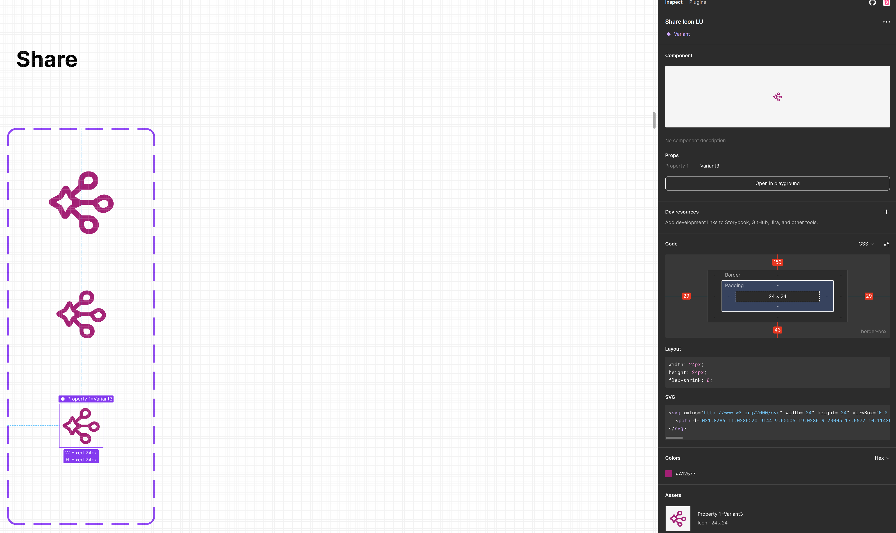
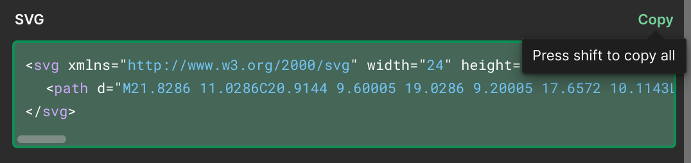

# Literary Universe icons

## Installation

There are two packages provided through this monorepo:

[@literary-universe/svg-icons](https://www.npmjs.com/package/@literary-universe/svg-icons)

and

[@literary-universe/styled-icons](https://www.npmjs.com/package/@literary-universe/styled-icons)

You can install them as any npm package.

## Usage

You use these packages as you would any [svg-icons](https://github.com/svg-icons/svg-icons) or [styled-icons](https://styled-icons.dev/).

## Adding new icon

All the icons should be designed by Literary Universe's design crew, following some conventions:

- The view box must have the dimensions of 32x32 units;
- Any horizontal assimetry must follow the left-to-right direction.
- The icon must be published on Figma.

As the icons might be arbitrarily scaled, the chosen source format for individual icon graphics is
SVG. As Figma can export graphics with some additional SVG attributes and elements, they must be
removed:

- The `<svg>` element must contain only two attributes: `viewBox` (probably with the value of`"0 0 32 32"`) and
  `xmlns`;
- XLink references (e.g. masks and clip paths) must be discarded;
- The `<path>` elements must keep only the `d` attribute, with no additional styling attribute;
- `<g>` and other elements must be stripped by [Iconli optimization tooling](https://iconly.io/tools/svg-convert-stroke-to-fill), keeping only `<path>` elements.

### Exporting from Figma

When exporting from Figma select the icon directly so that Figma offers you the SVG code in the sidebar.

Copy the SVG code:

Go then to [Iconly SVG stroke convertor](https://iconly.io/tools/svg-convert-stroke-to-fill), this will convert the SVG code to webfont SVG.

Save the file in `./svg-icons/packages/literary-universe/source`

Open up the file and make sure that `fill="none"` is not present in the top `<svg>` element.

Finally, you can optimize the SVG code in [SVGOMG](https://jakearchibald.github.io/svgomg/) tool. Besides the defaults it is recommended to turn on multipass, pretify markup, reduce duplicate elements with links, remove out-of-bounds paths and prefer viewBox to width/height.

Copy the resulting code (or override the existing file) in the resources folder.

The filenames define the icon names, so they
should stick with a basic rule: **an icon name must describe the icon shape, not its utility**. For instance:

- [ ] `message.svg` (wrong)
- [x] `balloon.svg` (right)

### svg-icons

Next step is to generate optimized svg icons from the source files.

Go to `./svg-icons/`

Make sure that you have `pnpm` installed and through it install dependencies.

Then run `npm run build`. This will take the source icons and build them for the package purposes.

You should run `npm run storybook` to check that the new icons are displaying properly.

Finally, if you have the permissions go to the package `./svg-icons/packages/literary-universe` and publish it.

### styled-icons

Once the svg-icons package is published you can make that into styled-icons package.

Go to `./styled-icons/packages/styled-icons/package.json` and in dependencies update `@literary-universe/svg-icons` to the latest version. 

Go to `./styled-icons/`. Install all dependencies via pnpm.

Then run `npm run build:icons`. That is it! You can now publish the package with the latest icons added.
