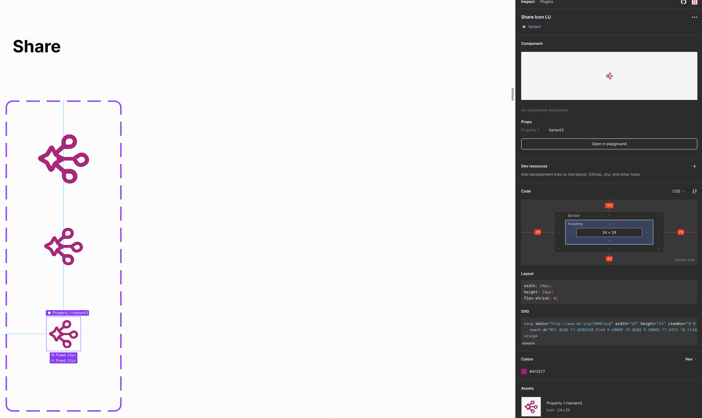
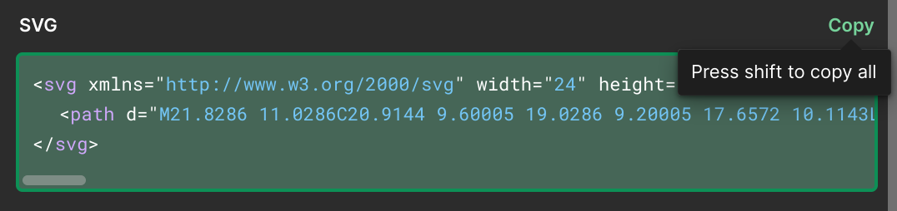

# Literary Universe icons

This repository owns the SVG artwork and generates two npm packages:

- [`@literary-universe/svg-icons`](https://www.npmjs.com/package/@literary-universe/svg-icons): optimized SVG files and metadata.
- [`@literary-universe/styled-icons`](https://www.npmjs.com/package/@literary-universe/styled-icons): React components with the [Styled Icons](https://styled-icons.dev/) API.

```tsx
import { Diary } from "@literary-universe/styled-icons/Diary";

<Diary size={32} color="currentColor" title="Diary" />;
```

Omit `title` for decorative icons; `StyledIconBase` supplies `aria-hidden` and
`focusable="false"`. For an icon-only button, give the **button** an accessible
name. Components forward refs and accept the normal StyledIcon props.

## Artwork

Canonical files live in `svg-icons/packages/literary-universe/source/`. Edit
those files, then regenerate both packages. Do not hand-edit generated React
components or copy SVG paths into the Literary Universe application.

- Use `viewBox="0 0 32 32"` and `xmlns="http://www.w3.org/2000/svg"`.
- Preserve the artwork's viewBox when importing existing designs: `Settings`
  intentionally uses `0 0 33 32`. Do not stretch or crop it to force a square.
- Use paths where practical. Preserve `fill="none"`, `fill-rule`, `clip-rule`,
  `stroke="currentColor"`, stroke widths, caps and joins when they affect the
  drawing. Stroke-to-fill conversion is optional; removing these attributes
  changes outlined icons into filled shapes.
- Remove hard-coded colors, editor metadata and unused clipping/definitions.
  The generated package supplies `fill="currentColor"`.
- Keep directional artwork left-to-right. Consumers handle direction changes.
- Keep existing filenames/export names stable, including historical names such
  as `Hearth` and `ProfileIcon`. Choose descriptive names for new artwork.
- Publish new design originals on Figma as part of the design workflow.

Figma export reference:




## Navigation and dashboard set (0.13.0)

[design/nav-icon-set.json](./design/nav-icon-set.json) records each imported
component, SVG filename and source revision in
[StorytellerCZ/Literary-Universe](https://github.com/StorytellerCZ/Literary-Universe).
All 35 icons from merged dashboard PR #905 are included, plus the 23 additional
icons from `feat/nav-icon-set` (`ee55c73a1`). The merged version of `Diary` wins
its insignificant coordinate-rounding difference. Existing exports are retained;
`AudioBooks`, `Bookmark`, `Diary` and `MangaComics` are new package exports.

The release also repairs the build path needed for this artwork:

- The SVG pnpm workspace lists its packages; previously `npm run build` could
  report success without building any icons.
- The styled package links the sibling SVG package for development, so both
  artifacts can be built and tested before either is published.
- The component generator resolves the SVG package from its consumer, preserves
  root stroke width and the complete viewBox, and emits the correct package
  import paths and original SVG names in its manifest.
- The styled build generates components once, compiles CJS/ESM/declarations,
  then generates Storybook from the completed package.
- SVG Storybook inherits a preview color instead of replacing `fill="none"`.
  The SVG manifest is sorted for reproducible builds.

## Build and verify

Use Node 24 and pnpm 10. Run these commands **from the repository root**:

```sh
pnpm --dir svg-icons install --frozen-lockfile
pnpm --dir styled-icons install --frozen-lockfile
pnpm --dir svg-icons build
pnpm --dir styled-icons build:icons
pnpm --dir styled-icons test:icons
```

The test renders every public component, checks per-icon imports and accessible
names/decorative behavior, verifies outlines and the non-square viewBox, and
exercises generation from a consumer-local SVG dependency. CJS, ESM and TypeScript
builds run as part of `build:icons`.

Preview with `pnpm --dir svg-icons storybook` or
`pnpm --dir styled-icons/storybook storybook`. Inspect both filled and outlined
icons, light/dark colors, and sizes used by the application.

## Prepare a release

Update both package versions and changelogs, build and verify as above, then:

```sh
mkdir -p dist
(cd svg-icons/packages/literary-universe && pnpm pack --pack-destination ../../../dist)
(cd styled-icons/packages/styled-icons && pnpm pack --pack-destination ../../../dist)
sha256sum dist/*.tgz
```

`dist/` is ignored. Review the tarballs (`tar -tzf dist/<name>.tgz`) and install
the styled tarball in a consumer to verify package resolution. The SVG package
contains only SVG/JSON metadata and package documentation; the styled package
contains generated JavaScript, declarations and package metadata.

Publishing is a separate maintainer step after review:

```sh
npm publish ./dist/literary-universe-svg-icons-0.13.0.tgz --access public
npm publish ./dist/literary-universe-styled-icons-0.13.0.tgz --access public
```

Then tag the source commit and publish release notes. Literary Universe can test
and ship the prepared styled tarball before registry publication. Once published,
replace its temporary `file:../vendor/...tgz` dependency with `0.13.0`, regenerate
its npm lockfiles, and remove the vendored artifact. No bundler or TypeScript
aliases are needed.
